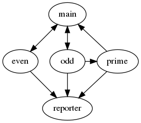

# Worker Topology &nbsp;&nbsp;&nbsp; [](https://travis-ci.org/alkan/WorkerTopology)

Node.js Worker Threads library is great. It is, however, a bit tricky to develop cleanly separated worker codes and build a sophisticated worker topology.  This library is developed to get rid of such difficulties.

Think of that you just
* list workers with optional settings,
* specify worker channels as pairs,
* and call the topology composer.

Then, voila!  You will have
* all workers are up and running,
* pointers to worker instances in the main thread,
* specified channels are created, port objects are attached to workers and the main thread

## Installation

```shell
npm install workertopology
```

## How to Use

In both main and worker sources you will just require `'workertopology'` module.  If you need additional worker threads functionality, you would require `'worker_threads'` module of Node.js, too.  

You start with definition of the topology in the main thread.  Probably the most primitive topology would consists of a main and a worker pair.  Every worker topology definition should contain `'workers'` object and a list of `'channels'`.

```javascript
const topologydef = {
    "workers": {
        "test": {path: "./spec/simple-worker.js", options: {stdout: false}}
    },
    "channels": [
        ["main", "test"]
    ]
}
```

The next easy step is to create the working topology by calling the composer.

```javascript
const worker_topolopy = require('workertopology');
let topology = worker_topolopy(topologydef);
topology.ports.test.postMessage('Hello worker');
topology.ports.test.on('message', (msg) => {
    console.log('Reply from worker: ', msg);
});
```
That is all.  You can attach your event handlers and start communication through ports of channels.  And what about workers?  As seen below, it is dead simple.

```javascript
const {ports} = require('workertopology');
ports.main.on('message', (msg) => {
    console.log('Main thread says:', msg);
    ports.main.postMessage('Hello main thread');
});
```
This simple sample depicts all API components of the library, indeed.  I hope that it is understandable intuitively.  Proceed the *API* section for more details.

## A More Sophisticated Sample

No matter how complex your topology is.  Let us try to realize this idea with the accumulator sample.

The main thread generates random integer numbers (greater than 2).  If the number is an even, it posts the number to `even` worker, otherwise posts it to `odd` worker.  If the number is a prime, `odd` worker posts it to `prime` worker.

The main thread posts `'dump'` command periodically and `status` command at the end to both `even` and `odd` workers.   `odd` worker forwards all commands to `prime` worker as well.  On `dump` command, accumulators post their data to `reporter` worker to print them on console.  And on `status` command the accumulators post their data to the main thread.

The following diagram would be helpful to imagine this scenario.



To implement this topology, we define it as follows.

```javascript
const accpath = './spec/accumulator.js';
const tdefs = {
    workers: {
        even: {path: accpath, options: {workerData: {name: 'even', source_port: 'main'}}},
        odd: {path: accpath, options: {workerData: {name: 'odd', source_port: 'main'}}},
        prime: {path: accpath, options: {workerData: {name: 'prime', source_port: 'odd'}}},
        reporter: './spec/acc-reporter.js'
    },
    channels: [
        ['main', 'even'],
        ['main', 'odd'],
        ['main', 'prime'],
        ['odd', 'prime'],
        ['even', 'reporter'],
        ['odd', 'reporter'],
        ['prime', 'reporter']
    ]
}
```

## Testing

```shell
npm test
```

## API

Depending on the role of requiring source file (main or worker), you will get different functionality as described below.

### Main Thread

#### Topology Definition

topology definition is an object which should contain `workers` and `channels` sub-objects.  Each worker definition is a named object.  Name can not be `'main'`, it is reserved for the main thread itself.  Worker definition would be either a string or an object.  If it is a string, it will be taken as the path of worker source file.  If it is an object, it contains mandatory `'path'` string and optional `'options'` object.  If it exists, the composer passes the `'options'` object to the worker thread constructor.  Please refer to Node.js API documentation for options object contents.

The `'channels'` object is an array.  Each element should be a two element array (thik it as javascript representation of a tuplo) which indicates two ends of the channel.  

#### Creating the Topology

`require('workertopology')` statement returns a function only.  You name it as you wish, such as `worker_topolopy`, `compose`, etc.  When you call it with topology definition, it creates all worker threads, creates channels, and attaches related ports to the workers.   Afterwards it returns an object which contains `workers` and `ports` sub-objects.  `workers` object contains the pointers to created workers right now.  And the `ports` object contains ports attached to the main thread.

### Worker Threads

In workerconst rnd = (upper_bound) =>  Math.ceil(Math.random() * upper_bound);
 threads `require('workertopology')` statement returns a named object &mdash; `ports`.  Each one contains only ports to related pairs.

## Internals

The main thread and each worker threads have their own context, therefore, own loader cache.  We preferred to export context specific parts by making `index.js` to be a context switcher:

```javascript
const src = isMainThread ? './src/main.js' : './src/worker.js';
module.exports = require(src);
```

The most challenging issue of this work is that as soon as the worker has been created, probably before attaching its ports, the worker source will be evaluated, and surely it will try to access these absent ports.  In order to handle this problem, we create workers with *proxy* port objects.  Whenever the reas port objects posted to the workers, we replace proxies with them, and move event listeners and message postings to the real ones.

Worker threads library is experimental in Node 10.x and 11.x versions.  That is why we need to start node with `'--experimental-worker'` switch.  Our test runner, Jasmine, however, does not take node options at its cli,   We handled this issue by writing a tiny `spec/test-runner.js` script and adding its starter into `package.json`'s scripts.

## See Also

[Group Reducer](https://www.npmjs.com/package/groupreducer)
